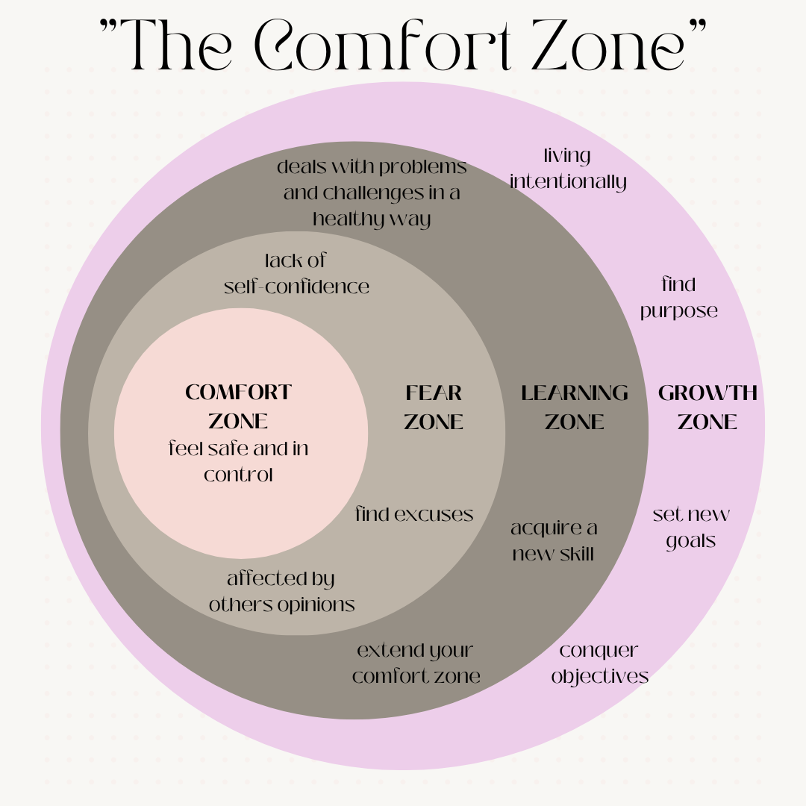

Imposter syndrome is loosely known as doubting your own strengths and abilities and feeling like a fake or not genuine to those around you. “I always feel like something of an impostor. I don’t know what I’m doing. I suppose that’s my one little secret, the secret of my success,” Jodie Foster said during the Hollywood Reporter’s Women in Entertainment Power 100 breakfast in 2007.

Dr Valerie Young, an expert on the matter, has broken down imposter syndrome into five groups: the Perfectionist, the Superwoman/man, the Natural Genius, the Soloist, and the Expert, in her book, The Secret Thoughts of Successful Women: Why Capable People Suffer From the Imposter Syndrome and How to Thrive in Spite of It.

I personally identify myself as the superwoman, as I tend to overwork myself to prove my worth, and if I feel like I have made a mistake, I beat myself up mentally. If you ask any of my close family and friends, I am my own worst enemy and critic sometimes. I have downplayed my knowledge and ability
in my work life many times. I find myself challenging my worth, especially when it comes to pay rises. My biggest weakness is that I’m a people pleaser; I don’t like letting people down, which has held me back a lot.

However, as I’ve gotten older, I have brought more supportive people into my life who are not afraid to give their opinion but not from a negative mindset. I have people who are not my biggest cheerleaders. It is a lot easier to be an “imposter” when you have a support group around you who are cheering you on to expand and trying something new.

Expanding to the next level requires getting out of the comfort zone. The comfort zone is where we know the likely end result of an outcome. Growth is the unknown, and impost syndrome is the dark fog that tries to keep me from knowing what’s on the other side.

According to Walter Cannon, a renowned physiologist, humans are flight-or-fight beings; humans also love certainty; when humans grow to know something is “safe” and won’t result in death, we generally grow comfortable. However, when we leave this safety net and try to explain to that next level, the imposter syndrome might just be the flight or fight response built into us.

But the main thing to remember is that we all start somewhere and are all “imposters”. Remember, being an “imposter” is just a label. We get to decide if we want to label ourselves as imposters or not. That doesn’t mean we don’t face hurdles along the way, but we can choose not to associate ourselves with a label. We get to decide if we want to accept that we will make mistakes, that we will get quicker with time, that we won’t forget what a particular code means and won’t have to go back and find what it does and that we won’t have to spend a couple of hours trying to get a graph produced correctly via code (definitely been there recently for one of my uni courses). In my perspective, understanding coding is like building a house, and every theory and code comment we learn is a brick in that house. If we keep taking those steps, the house will eventually be built (until I want to start landscaping the garden). I don’t expect the process (i.e. learning) to ever stop, and I hope it doesn’t.

## How I move out of my comfort zone

Leaving the comfort zone is the first big hurdle, but once we get some momentum, it’s much easier to keep growing! Here are some things/habits I do to keep me motivated.

1. Finding someone who is already living the life I want or who inspires me. My following list when it comes to coding:

@tech.unicorn
@codespiration
@polinacsv
@mili.codes
@maisyleigh

My following list when it comes to motivation (they are on the spiritual side):

@_samanthadaily
@themikaylajai

2. The bucket theory. One of @_samanthadaily podcast episodes (@makeshifthappenpodcast) talked about the bucket theory, where most of us are all trying to be superheroes and do a little of a lot of things every day. When I heard this, I had an ‘oh crap’ moment; there was another superwoman moment for me, trying to do many little things. The theory is if you have 1 cup of water and have to pour that cup across, say, 10 buckets (I.e. 10 areas of your life), it will take much longer to fill these buckets than, say 2 or 3 buckets. As the seasons (the personal phases of your life, not the weather change) of my life change, so do these buckets. When I have my 6-7 week subject block, my buckets are uni, health/fitness, and family downtime. When I have the 2 weeks break off uni, it’s health/fitness, blog, family/friends getting outside. Anything other than that or more than that will just have to wait until a new season comes around (maybe once uni is done).

3. Remember your why. Going back to uni to study something other than engineering, doing my master and adding that extra HECS debt to my name was daunting. Starting this blog was extremely daunting! Knowing my why helped me make those big decisions a lot easier: “I’m doing this to better myself and to have more opportunities”, “I’m doing this because it is what I’m passionate about”, and “I creating this blog because I want to help others find motivation in going after a dream”.

4. Writing a list of all the things I can achieve if I walk through the imposter syndrome fog and keep growing. Or create a vision board! I created a board of the life I want to step into via learning coding.

5. Write down what you need to do but in small steps. I do the easy ones first to feel like I am accomplishing the tasks.

6. Communicating the importance of coding with the people closest to me. My partner has been the biggest support system, mainly because I’m honest that I want to try coding to better myself and my career and hopefully give us a better life. He dreams of getting a big Chev truck, so I have added that to my vision board to help get that for him one day. 

7. Setting aside 15 mins a day to look at/practice coding, whether on youtube, a website or my uni notes. Every little step daily motivates me and keeps me in the “I’m a coder” mindset. I’m planning on write ting a review on the Atomic Habits book so keep an eye out for that as it will relate to this point.